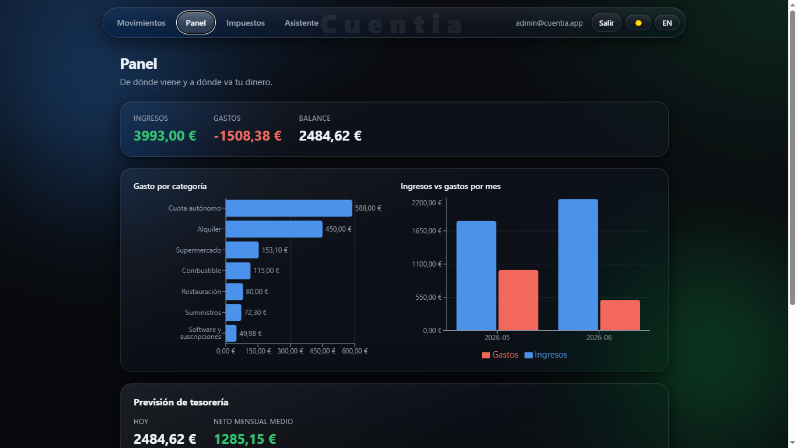
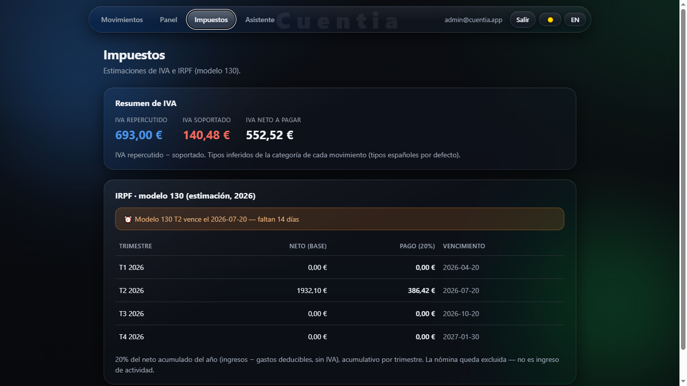
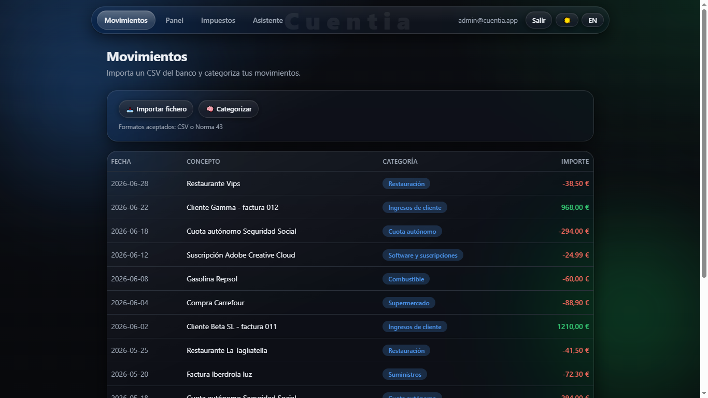

# Cuentia — AI cash-flow & tax copilot for freelancers and SMBs

**Languages:** [English](#english) · [Español](#español)

> Import your bank movements (or connect your bank), let AI categorize them, issue **Verifactu**
> invoices, and instantly see your VAT, estimated income tax and cash-flow forecast — the numbers
> your accountant asks for, without the spreadsheet.

> ⚠️ **Work in progress.** This project is being built in public, step by step, with every
> decision documented in [`docs/`](docs/). Follow the build in [`docs/DEVLOG.md`](docs/DEVLOG.md).

### 🌐 Live demo: **[cuentia-snowy.vercel.app](https://cuentia-snowy.vercel.app/)**

Register (or log in) and click **“Load sample data”** to explore with realistic movements.
*The backend runs on a free tier, so the very first request may take ~30–60 s to wake up.*

[](https://github.com/R0b3r7DEV/cuentia/actions/workflows/ci.yml)


## 📸 Screenshots

| Dashboard — spending, income vs expenses, cash-flow forecast | Taxes — VAT & IRPF (modelo 130) with deadline alert |
|---|---|
|  |  |



---

## English

### The problem

Every freelancer (*autónomo*) and small business in Spain faces the same monthly grind: export
the bank statement, open a spreadsheet, and manually tag each movement — supplier, income, expense
category, VAT — so they know how much tax they owe and whether they'll make payroll. It is tedious,
error-prone, and most of them only find out their real numbers when the quarter is already closing.

### The solution

**Cuentia** turns raw bank movements into financial clarity — and now issues compliant invoices too:

- **Import** movements — CSV, Spanish *Norma 43*, or **real open banking** (GoCardless / PSD2).
- **Auto-categorize** each movement with AI (supplier, expense category, income).
- **Invoicing with Verifactu** — issue invoices sealed into a **tamper-evident SHA-256 hash chain**, each
  with its AEAT **QR** and **RegistroAlta XML** (Spain's 2026 anti-fraud e-invoicing regulation).
- **Tax panel**: output vs input VAT, estimated IRPF, and quarterly deadline alerts (modelo 130 / 303).
- **Cash-flow forecast** for the next 30 / 60 / 90 days.
- **Ask in plain language**: *"How much did I spend on software this quarter?"*

#### 🔒 Engineering highlight — the Verifactu hash chain

Every issued invoice generates a *registro de alta* carrying a **SHA-256 fingerprint chained to the
previous one** (the layout of Orden HAC/1177/2024). Altering any past invoice breaks every hash after it,
and `GET /api/invoices/verify` walks the chain to prove — or disprove — its integrity. It's the kind of
correctness-critical, spec-driven feature that shows up in real fintech: exact money in integer cents,
gapless numbering, and a cryptographic audit trail. See [guide 25](docs/guide/25-verifactu-hash-chain.md).

### Why this project exists

I'm a web development student with a second diploma in **Business Administration & Finance**. This
project sits exactly on that intersection: the hard part isn't the CRUD, it's *knowing what the
numbers mean* — VAT mechanics, Spanish tax models, what a healthy cash flow looks like. That domain
knowledge is the core of the product.

### What it solves — and what would make it a real product (honest take)

Product sense matters, so let's be honest about scope. Cuentia started as a **"vitamin"** (visibility:
categorized movements, an **estimate** of VAT/IRPF, a cash-flow forecast) and now reaches toward the
**"painkiller"** problems freelancers actually *pay* to solve:

- it **issues Verifactu invoices** with a tamper-evident hash chain, QR and XML;
- it can **import movements straight from the bank** via open banking (GoCardless).

What still separates it from a product people pay for is the last mile of **trust and action**:

- **Real fiscal submission** to the AEAT — the Verifactu SOAP web service. Deliberately out of scope here:
  Cuentia isn't a registered issuer, so the QR/XML target the AEAT **test** host (a faithful demonstration,
  not a live filing). See [ADR 0003](docs/decisions/0003-verifactu-invoicing.md).
- An **accurate, per-line tax engine** (deductibility rules, exemptions, reverse charge…).
- A **live** open-banking run — the integration is built and unit-tested against the documented API, but
  ships **behind a credentials flag** (creating GoCardless app credentials needs real KYC data). See
  [guide 27](docs/guide/27-open-banking.md).
- **Filing / accountant integration** — validated with real users first.

The goal was never revenue: it's to demonstrate building **serious business software** at the intersection
of web development and finance — and knowing exactly where that product line sits is part of the skill.

### Tech stack

- **Backend:** PHP · Symfony · Doctrine · PostgreSQL
- **Frontend:** React · Vite
- **AI:** Anthropic Claude (categorization + natural-language queries)
- **e-invoicing:** Verifactu — SHA-256 hash chain · QR (`endroid/qr-code`, SVG) · RegistroAlta XML
- **Open banking:** GoCardless Bank Account Data (PSD2), behind a feature flag
- **Quality:** PHPUnit (36 unit + integration tests) · GitHub Actions CI · bilingual docs (`docs/guide/` 00→27)

### Run it locally

Requirements: PHP, Composer, Symfony CLI, PostgreSQL and Node.js (see
[guide 00](docs/guide/00-environment.md)). Then:

```powershell
powershell -ExecutionPolicy Bypass -File .\start-dev.ps1
```

This starts PostgreSQL, the Symfony API (`:8000`) and the Vite dev server, then open
**http://localhost:5173**. The first time, install dependencies (`cd backend; composer install`
and `cd frontend; npm install`) and create the database (see [guide 03](docs/guide/03-database-and-entities.md)).

> The servers only respond while they are running — if the page says *connection refused*, start them.

### Documentation

| Doc | What it is |
|---|---|
| [docs/ROADMAP.md](docs/ROADMAP.md) | Phased plan, from MVP to full product |
| [docs/ARCHITECTURE.md](docs/ARCHITECTURE.md) | System design and domain model |
| [docs/DEVLOG.md](docs/DEVLOG.md) | Running log of every step taken |
| [docs/decisions/](docs/decisions/) | Architecture Decision Records (ADRs) |

---

## Español

### El problema

Cada autónomo y pequeña empresa en España sufre la misma rutina mensual: exportar el extracto del
banco, abrir una hoja de cálculo y etiquetar a mano cada movimiento —proveedor, ingreso, categoría de
gasto, IVA— para saber cuánto impuesto debe y si llegará a fin de mes. Es tedioso, propenso a errores,
y la mayoría solo descubre sus números reales cuando el trimestre ya se está cerrando.

### La solución

**Cuentia** convierte los movimientos bancarios en claridad financiera — y ahora también emite facturas:

- **Importar** movimientos — CSV, **Norma 43**, o **banca abierta real** (GoCardless / PSD2).
- **Categorización automática** de cada movimiento con IA (proveedor, categoría de gasto, ingreso).
- **Facturación con Verifactu** — emite facturas selladas en una **cadena de hash SHA-256 inalterable**,
  cada una con su **QR** de la AEAT y su **XML RegistroAlta** (normativa antifraude de 2026).
- **Panel fiscal**: IVA repercutido vs soportado, estimación de IRPF y avisos de trimestre (modelo 130 / 303).
- **Previsión de tesorería** a 30 / 60 / 90 días.
- **Preguntar en lenguaje natural**: *"¿cuánto gasté en software este trimestre?"*

#### 🔒 Detalle de ingeniería — la cadena de hash Verifactu

Cada factura emitida genera un *registro de alta* con una **huella SHA-256 encadenada a la anterior** (el
formato de la Orden HAC/1177/2024). Alterar cualquier factura pasada rompe todos los hashes posteriores, y
`GET /api/invoices/verify` recorre la cadena para demostrar — o refutar — su integridad. Es el tipo de
función crítica y guiada por especificación que aparece en fintech real: dinero exacto en céntimos enteros,
numeración sin huecos y un rastro de auditoría criptográfico. Ver [guía 25](docs/guide/25-verifactu-hash-chain.md).

### Por qué existe este proyecto

Soy estudiante de desarrollo web con un segundo título en **Administración y Finanzas**. Este proyecto
está justo en esa intersección: lo difícil no es el CRUD, es *saber qué significan los números* —la
mecánica del IVA, los modelos fiscales españoles, cómo se ve una tesorería sana—. Ese conocimiento del
dominio es el núcleo del producto.

### Qué resuelve — y qué le faltaría para ser producto (visión honesta)

El criterio de producto importa, así que seamos honestos con el alcance. Cuentia empezó como una
**"vitamina"** (visibilidad: movimientos categorizados, una **estimación** de IVA/IRPF, una previsión de
tesorería) y ahora se acerca a los problemas **"analgésico"** por los que un autónomo *paga* de verdad:

- **emite facturas Verifactu** con cadena de hash inalterable, QR y XML;
- puede **importar movimientos directamente del banco** vía banca abierta (GoCardless).

Lo que aún la separa de un producto de pago es la última milla de **confianza y acción**:

- **Presentación fiscal real** ante la AEAT — el servicio web SOAP de Verifactu. Deliberadamente fuera de
  alcance: Cuentia no es un emisor registrado, así que el QR/XML apuntan al host de **pruebas** de la AEAT
  (una demostración fiel, no una presentación real). Ver [ADR 0003](docs/decisions/0003-verifactu-invoicing.md).
- Un **motor fiscal preciso por línea** (deducibilidad, exenciones, inversión del sujeto pasivo…).
- Una ejecución **en vivo** de banca abierta — la integración está construida y testeada contra la API
  documentada, pero va **tras un flag de credenciales** (crearlas exige datos KYC reales). Ver
  [guía 27](docs/guide/27-open-banking.md).
- **Integración de presentación / gestor** — validado antes con usuarios reales.

El objetivo nunca fue facturar: es demostrar que sé construir **software de negocio serio** en la
intersección entre desarrollo web y finanzas — y saber exactamente dónde está esa línea de producto forma
parte de la habilidad.

### Stack tecnológico

- **Backend:** PHP · Symfony · Doctrine · PostgreSQL
- **Frontend:** React · Vite
- **IA:** Anthropic Claude (categorización + consultas en lenguaje natural)
- **Factura electrónica:** Verifactu — cadena de hash SHA-256 · QR (`endroid/qr-code`, SVG) · XML RegistroAlta
- **Banca abierta:** GoCardless Bank Account Data (PSD2), tras un flag de función
- **Calidad:** PHPUnit (36 tests unitarios + integración) · GitHub Actions CI · docs bilingües (`docs/guide/` 00→27)

### Ejecutar en local

Requisitos: PHP, Composer, Symfony CLI, PostgreSQL y Node.js (ver
[guía 00](docs/guide/00-environment.md)). Después:

```powershell
powershell -ExecutionPolicy Bypass -File .\start-dev.ps1
```

Esto arranca PostgreSQL, la API Symfony (`:8000`) y el servidor de Vite; luego abre
**http://localhost:5173**. La primera vez, instala dependencias (`cd backend; composer install`
y `cd frontend; npm install`) y crea la base de datos (ver [guía 03](docs/guide/03-database-and-entities.md)).

> Los servidores solo responden mientras están en marcha — si la página dice *connection refused*,
> arráncalos.

### Documentación

| Documento | Qué es |
|---|---|
| [docs/ROADMAP.md](docs/ROADMAP.md) | Plan por fases, del MVP al producto completo |
| [docs/ARCHITECTURE.md](docs/ARCHITECTURE.md) | Diseño del sistema y modelo de dominio |
| [docs/DEVLOG.md](docs/DEVLOG.md) | Diario de cada paso dado |
| [docs/decisions/](docs/decisions/) | Registros de Decisiones de Arquitectura (ADR) |
